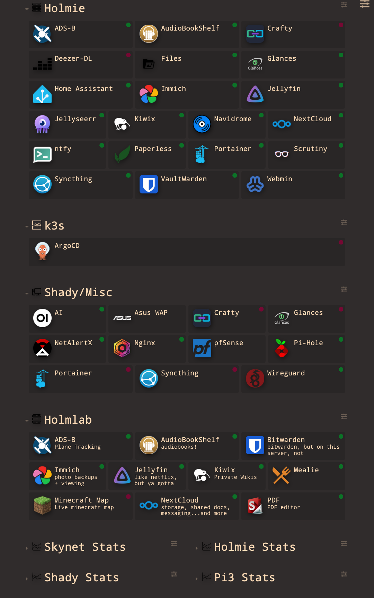

# Docker compose based homelab

The idea here is a single node server. With more than 40 containers, organization is key. This directory is where the config is. Have a poke around. Inside each folder is a `docker-compose.yml` file. Areas where editing is needed will be marked, but the files should be able to just be ran with `docker compose up -d`

Remember; if there is a file (for example `settings.json`) in the volumes section of any docker-compose.yml, then that file has to already exist.
So make sure to run `touch settings.json` first, or docker will make the *FOLDER* `settings.json` instead of the file.

## My Dashy Dashboard:

What is here:

- ADSB
- Ollama + OpenWebUI
- Arr Stack
- AudioBookShelf
- Crafty Controller
- Dashy
- FileBrowser
- Forgejo
- Glances
- Home Assistant
- Pi-Hole
- Immich
- Jellyfin
- Jellyseerr
- Kiwix
- Mealie
- Navidrome
- Nginx
- NetAlertX
- NextCloud
- NTFY
- Paperless-NGX
- Portainer
- Proxy (http, socks5)
- rclone/restic (backups)
- Scrutiny
- StirlingPDF
- Syncthing
- UpTimeKuma
- VaultWarden
- WatchTower
- WireGuard

# How to use this repo:

1. `git clone https://github.com/shadybraden/homelab.git` 
2. `cd homelab/docker/` 
3. `cp .env.sample .env` 
4. Now use `nano .env` (or any other text editor) to edit the file `.env` and add in your environment variables. The defaults will allow the container to function, but may not be ideal. For example, all passwords and secrets are simply "password". Once you edit this file, or at any point, run `sudo chmod 600 .env && sudo chown root:root .env` to secure it a bit more. (note that this works with docker and *probably not* podman)
5. Once the `.env` file is setup as desired, `cd <container name>` and see the README.md for that container's specific instructions.
6. Once satisfied, run this to start the container: `docker compose --env-file ../.env -v up -d` 
7. Now if you want to pull the latest, run `git pull` then compare the latest in `env` to your `.env` 

---

#### todo:

- figure out how to use bitwarden cli to fetch secrets on container start
    - make it so you have to manually unlock the vault first
- use [renovate](https://nickcunningh.am/blog/how-to-automate-version-updates-for-your-self-hosted-docker-containers-with-gitea-renovate-and-komodo) to automate updates instead of watchtower
- use some sso authentication method
- use traefik?